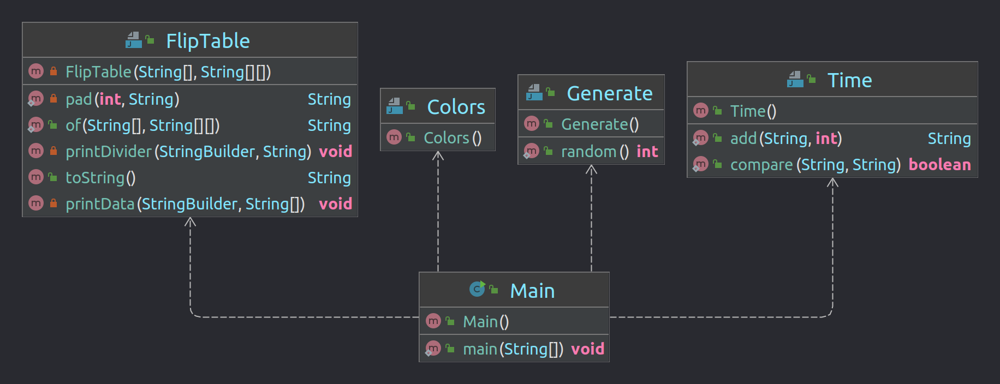

# Timetable

Simple version for flight table #1

#Description

> There are ```8``` airplanes and ```9``` cities. Each airplane must travel to all cities in a week and come back Baku. There are two flight are where the airplane can take off. Each flight has a duration. For example ```3``` hours. ```15``` minutes delay is followed between two flights from same are.

#UML diagram for project



#Algorithm

> If planes couldn't fly to all cities and arrive in the same week then it have to show us an error: "Couldn't make all flights in the same week".

> Write methods for comparing and adding time.

> Write a method for generating number for specified range 

> Write a class for beautifying output table 


